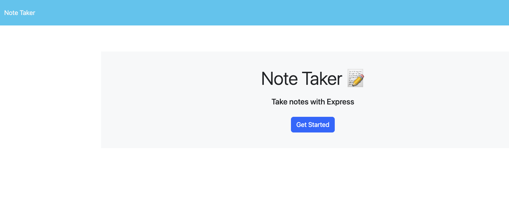
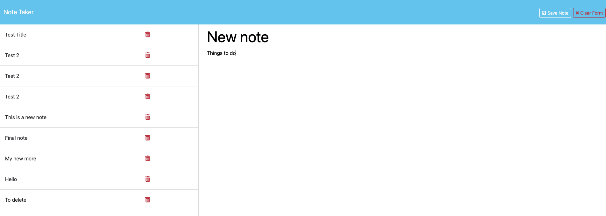

# Your Thought Keeper

This is a simple note-taking application designed for small business owners to organize their thoughts and keep track of tasks they need to complete.

## Table of Contents
- [Features](#features)
- [Installation](#installation)
- [Usage](#usage)
- [Visuals](#visuals)
- [License](#license)
- [Contributing](#contributing)
- [Tests](#tests)
- [Questions](#questions)

## Features

- Landing page with a link to access the notes page.
- Save Note button and Clear Form button appear upon entering a new note title and text.
- Ability to save new notes, which then appear in the list of existing notes.
- Ability to click on existing notes to view and edit them.

## Installation
To use this note taker, simply follow the deployment link provided:

Clone this repository to your local machine:

    git clone git@github.com:J-0987/readmeGenerator.git

Navigate to the project directory:

    cd readme-generator

Install dependencies using npm:

    npm install

## Usage

To generate a README file for your project, run the following command:

    node index.js

Follow the prompts to provide information about your project. Once you've completed all the prompts, the README file will be generated in the current directory.

## Visuals

Application's main page

()

Notes page

## Contributing

Contributions are welcome! If you have any ideas for improvements or new features, feel free to open an issue or submit a pull request.

Alternatively, you can reach me by email at jasminelassonde@gmail.com

## License

This project is licensed under the MIT License.

## Acknowledgements

This project was inspired by the need for easy README file generation for various projects.
Special thanks to the Inquirer module for providing a simple and intuitive CLI interface.
